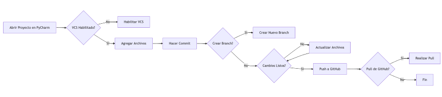

## **Uso de GitHub en PyCharm (Entorno Gráfico)**

1. **Abrir Proyecto en PyCharm**: Primero, abre tu proyecto en PyCharm.
2. **Habilitar Control de Versiones**: Ve a `VCS` > `Enable Version Control Integration`, y selecciona Git.
3. **Agregar Archivos**: Haz clic derecho en los archivos que deseas agregar y selecciona `Git` > `Add`. O usa la opción `Commit` en el menú `VCS` y luego selecciona los archivos a agregar.
4. **Hacer Commit**: Usa la ventana `Commit` para escribir tu mensaje de commit y confirma los cambios.
5. **Crear Branch**: Si necesitas crear un nuevo branch, ve a `VCS` > `Git` > `Branches` y selecciona `New Branch`.
6. **Cambiar de Branch**: Utiliza el mismo menú `Branches` para cambiar entre ellos.
7. **Subir Cambios a GitHub**: Una vez hecho el commit, utiliza `VCS` > `Git` > `Push` para subir tus cambios al repositorio remoto en GitHub.
8. **Pull**: Para actualizar tu proyecto con los últimos cambios de GitHub, usa `VCS` > `Git` > `Pull`.

