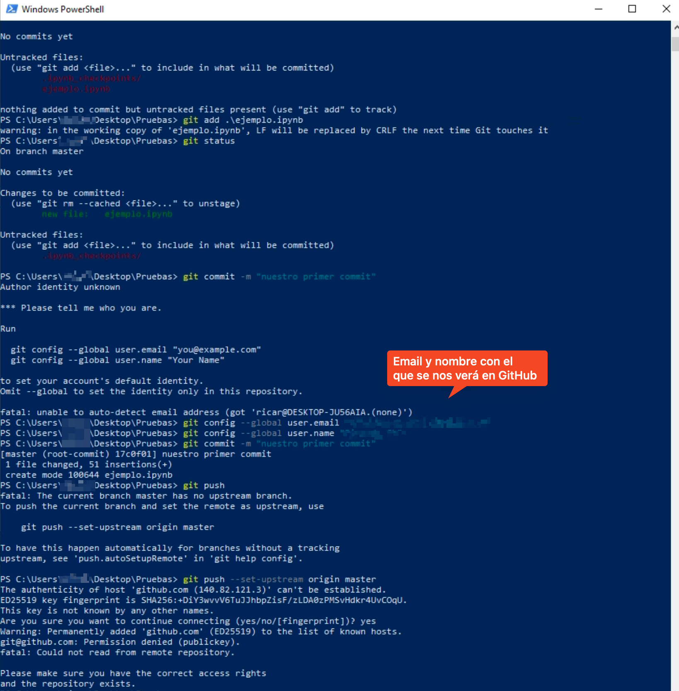

# Guía Completa para Usar JupyterLab con GitHub

Esta guía está diseñada para ayudar a usuarios sin experiencia previa en informática a utilizar **JupyterLab** junto con **GitHub**. Aprenderás cómo instalar las herramientas necesarias, crear y editar notebooks en JupyterLab, y utilizar GitHub para gestionar tu trabajo. Además, te explicaremos cómo resolver problemas comunes como conflictos en Git, manejo de credenciales y trabajo con ramas.

Se incluye un ejemplo práctico detallado para reforzar el aprendizaje y enlaces a recursos adicionales.

---

## Índice

1. Introducción a JupyterLab y GitHub  
2. Instalación y configuración inicial  
   - Instalación de Git en Windows  
   - Instalación de JupyterLab  
   - Configuración de GitHub  
3. Uso de GitHub desde JupyterLab  
   - Clonar repositorios  
   - Crear y configurar un nuevo repositorio  
   - Instalación de extensiones para GitHub  
4. Subida y versionado de notebooks en GitHub  
   - Realizar commits y push desde JupyterLab  
   - Verificar cambios en GitHub  
5. Resolución de conflictos en Git desde JupyterLab  
   - Identificar y solucionar conflictos  
   - Herramientas para comparar versiones  
6. Ejemplo práctico  
7. Recursos adicionales y enlaces  

---

## 1. Introducción a JupyterLab y GitHub

### ¿Qué es JupyterLab?

JupyterLab es un entorno interactivo basado en la web que permite ejecutar código en diferentes lenguajes de programación (como Python) y visualizar los resultados en tiempo real. A diferencia de Jupyter Notebook, JupyterLab ofrece una interfaz más flexible y modular, permitiendo abrir varios archivos a la vez, organizar mejor el espacio de trabajo y extender sus funcionalidades con plugins.

### ¿Qué es GitHub y por qué usarlo con JupyterLab?

GitHub es una plataforma de alojamiento de repositorios Git que facilita la gestión del control de versiones y la colaboración entre usuarios. Integrar JupyterLab con GitHub permite:

- Almacenar notebooks de forma segura en la nube.
- Rastrear cambios y versiones de notebooks.
- Colaborar con otros usuarios en proyectos compartidos.
- Automatizar tareas como la revisión de cambios y la sincronización de datos.

---

## 2. Instalación y Configuración Inicial

### Instalación de Git en Windows

1.  **Descargar Git:** Visita la página oficial de Git (https://git-scm.com) y descarga la versión adecuada para Windows.
    
    
2.  **Ejecutar el instalador:** Sigue las instrucciones manteniendo las opciones predeterminadas.
    
    
3.  **Verificar la instalación:** Abre Git Bash y ejecuta `git --version` para confirmar que Git está instalado correctamente.
    

### Instalación de JupyterLab

#### Opción 1: Usando Anaconda (Recomendado para principiantes)

1.  Descarga e instala Anaconda desde https://www.anaconda.com/products/distribution.
    
    
    
    
    
2.  Abre **Anaconda Navigator** y lanza **JupyterLab**.
    
    

#### Opción 2: Usando pip

1.  Si tienes Python instalado, abre una terminal y ejecuta `pip install jupyterlab`.
2.  Inicia JupyterLab con `jupyter lab`.
    *(Nota: Se usaría una interfaz similar a la de Jupyter_Gui.png mostrada arriba al lanzar)*

### Configuración de GitHub

1.  **Crear una cuenta en GitHub:** Regístrate en https://github.com/ si no tienes una cuenta.
2.  **Generar un token de acceso personal:**
    - Ve a **Settings > Developer settings > Personal access tokens** en GitHub.
    - Genera un token con permisos para repositorios.
3.  **Configurar Git con tu usuario de GitHub:**
    ```sh
    git config --global user.name "Tu Nombre"
    git config --global user.email "tu_correo@example.com"
    ```
4.  **Autenticarse con GitHub:** Introduce el token cuando Git lo solicite al hacer `push`.
    

---

## 3. Uso de GitHub desde JupyterLab

### Conectar un repositorio de GitHub con JupyterLab

1.  **Clonar un repositorio existente:**
    - Copia la URL del repositorio desde GitHub.
      
    - En el panel de Git en JupyterLab, haz clic en **Clone a Repository**.
    - Introduce la URL y presiona Enter.

2.  **Iniciar un repositorio nuevo:**
    - Crea una carpeta en JupyterLab.
      
    - Abre un terminal en JupyterLab y ejecuta:
      ```sh
      git init
      git remote add origin [https://github.com/tu_usuario/nombre_repo.git](https://github.com/tu_usuario/nombre_repo.git)
      ```
      
      

### Instalación de extensiones para GitHub en JupyterLab

1.  Abre el gestor de extensiones en JupyterLab.
2.  Busca e instala **Git** y **GitHub**.
3.  Proporciona el token de acceso a la extensión de GitHub cuando lo solicite.

---

## 4. Subida y versionado de notebooks en GitHub

1.  **Modificar archivos:** Abre un notebook y edita contenido.
    
2.  **Commit:** En el panel de Git, agrega el archivo, escribe un mensaje y confirma.
3.  **Push:** Haz clic en el botón de Push para enviar los cambios a GitHub.
4.  **Verificar en GitHub:** Confirma que los archivos se han subido correctamente.
    

---

## 5. Resolución de conflictos en Git desde JupyterLab

A veces, al intentar hacer `push` de tus cambios locales a GitHub (`git push origin master`), Git puede rechazar la subida. Esto ocurre si existen cambios en el repositorio remoto (GitHub) que tú todavía no tienes en tu copia local. Es una medida de seguridad para evitar sobrescribir el trabajo de otros o cambios que hayas hecho desde otro lugar.

Verás un error en la terminal (o en el panel de Git de JupyterLab) similar al que se muestra en la imagen, indicando que el `push` fue rechazado (`rejected`) y sugiriendo hacer `Workspace first` o `git pull`.


El mensaje clave es: `Updates were rejected because the remote contains work that you do not have locally.` y la sugerencia: `hint: 'git pull' before pushing again.`

**Pasos para solucionar esta situación:**

1.  **Integrar cambios remotos:** El primer paso es descargar los cambios que están en GitHub y combinarlos con tu trabajo local. Abre una terminal en JupyterLab (o usa el botón/opción "Pull" en la extensión de Git) y ejecuta:
    ```sh
    git pull origin master # Asegúrate de usar el nombre correcto de tu rama principal si no es 'master'
    ```

2.  **Resolver conflictos (si ocurren durante el `pull`):**
    * **Si `git pull` se completa sin errores:** ¡Genial! Git pudo combinar automáticamente los cambios remotos con los tuyos. Ahora puedes intentar hacer `push` de nuevo (ver paso 4).
    * **Si `git pull` informa de un `Merge conflict`:** Esto significa que tanto tú localmente como alguien (o tú mismo desde otro lugar) modificaron las *mismas líneas* en el *mismo archivo*. Git no puede decidir qué versión mantener y marca el archivo como conflictivo.
        * Abre el archivo conflictivo (por ejemplo, un notebook `.ipynb`) en JupyterLab. Puede que necesites abrirlo como texto plano para ver claramente los marcadores.
        * Busca los marcadores de conflicto insertados por Git:
            * `<<<<<<< HEAD`: Marca el inicio de tus cambios locales.
            * `=======`: Separa tus cambios de los cambios remotos.
            * `>>>>>>> [commit hash/referencia remota]`: Marca el final de los cambios remotos.
          
        * **Edita manualmente el archivo:** Elimina los marcadores (`<<<<<<<`, `=======`, `>>>>>>>`) y ajusta el contenido para que quede la versión final correcta, combinando las partes necesarias de ambas versiones (la tuya y la remota).
          

3.  **Confirmar la resolución del conflicto (si ocurrió):** Si tuviste que editar manualmente un conflicto en el paso 2:
    * Guarda el archivo modificado.
    * Añade el archivo resuelto al área de "staging" usando el panel de Git en JupyterLab o ejecutando en la terminal:
        ```sh
        git add <nombre_del_archivo_resuelto>
        ```
    * Realiza un commit para registrar que has resuelto el conflicto. El mensaje de commit por defecto suele ser adecuado, o puedes escribir uno propio:
        ```sh
        git commit -m "Fusionados cambios remotos y resuelto conflicto en <nombre_del_archivo>"
        ```

4.  **Subir los cambios finales:** Ahora que tu copia local incluye los cambios que estaban en remoto y cualquier conflicto ha sido resuelto y confirmado, puedes volver a intentar subir todo a GitHub:
    ```sh
    git push origin master
    ```
    Esta vez, el `push` debería tener éxito.

---

## 6. Ejemplo Práctico Completo

1.  **Crear un repositorio en GitHub y clonarlo en JupyterLab.**
    
    *(Clonación como en sección 3.1)*
2.  **Crear y editar un notebook, hacer commit y push.**
    
    *(Edición, commit y push inicial como en sección 4)*
3.  **Simular un conflicto:**
    * Edita el mismo notebook en la interfaz web de GitHub y guarda los cambios (commit).
    * Vuelve a JupyterLab y edita el *mismo* notebook en una línea cercana o idéntica. Haz commit localmente.
4.  **Intentar push y resolver el conflicto:**
    * Intenta hacer `git push` desde JupyterLab. Fallará con el error mostrado en la sección 5.
    * Ejecuta `git pull`. Git marcará el archivo con conflictos.
    * Abre el archivo, edita los marcadores (`<<<<<<<`, `=======`, `>>>>>>>`) para dejar la versión deseada.
      
      
    * Haz `git add <archivo>` y `git commit`.
    * Finalmente, haz `git push` de nuevo. ¡Ahora debería funcionar!

---

## 7. Recursos y Enlaces

-   [Documentación oficial de JupyterLab](https://jupyter.org/)
-   [Documentación oficial de GitHub](https://docs.github.com/)
-   [Curso gratuito de Git y GitHub](https://www.udemy.com/course/git-and-github-crash-course/)
