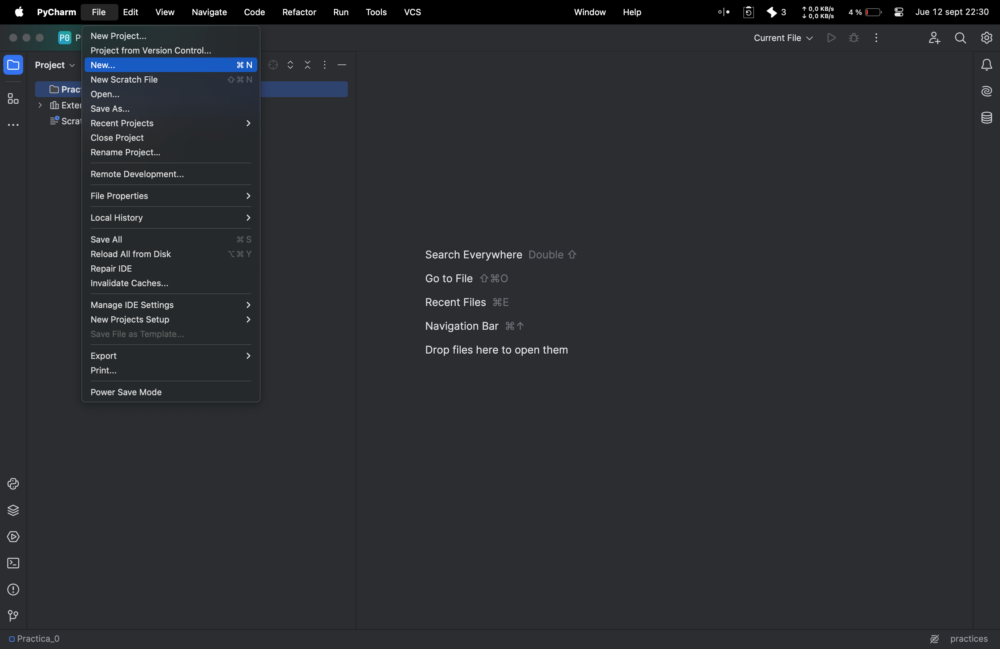
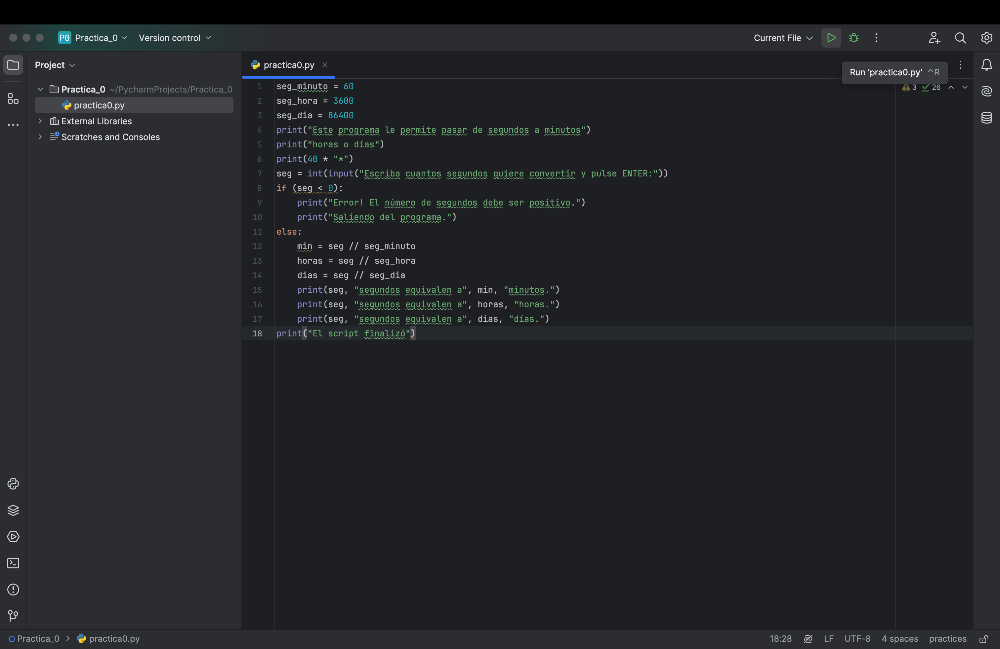
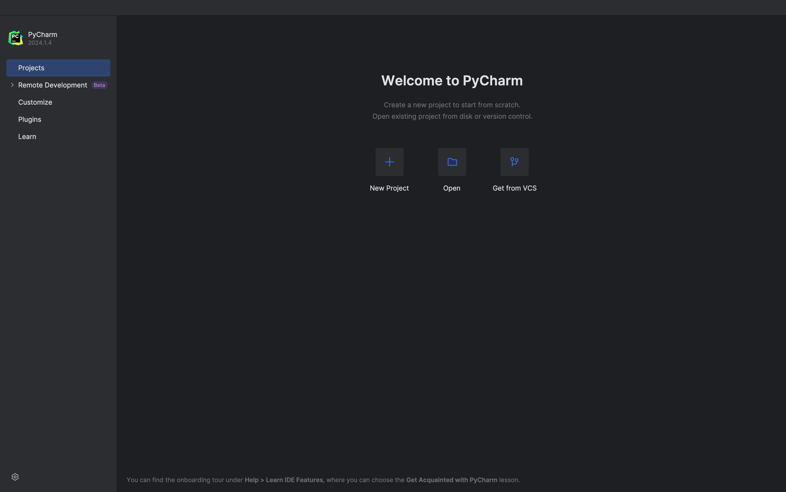
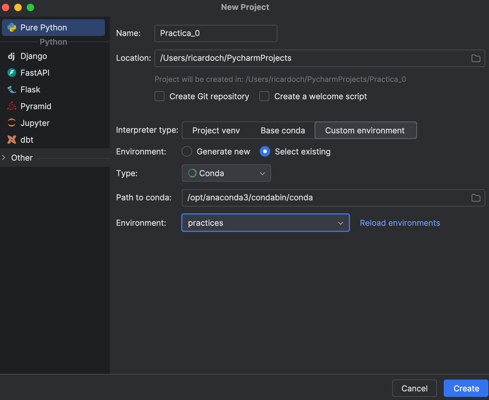

# PROGRAMACIÓN EN TIG  
## Máster en TIG  

### PRÁCTICA 0:  
Entorno de desarrollo y construcción de un programa en Python  

#### COMPETENCIAS  
- Conocer un Entorno de Desarrollo Integrado (IDE - Integrated Development Environment).  
- Editar, compilar y ejecutar un programa sencillo.  
- Aprender a depurar un programa.  

#### TEMPORIZACIÓN  
- Inicio de la práctica: Semana del 26 de septiembre.  
- Tiempo de desarrollo de la práctica: 1 semana.  
- Evaluación: Sin evaluación (práctica optativa).  

---

### 1. Introducción al IDE PyCharm  

Durante el curso emplearemos un Integrated Development Environment (IDE) para realizar las prácticas de la asignatura. Para cada una de ellas se creará un proyecto de trabajo en ese IDE.  
Algunos ejemplos de IDEs de uso extendido actualmente son:  
- MS Visual Studio  
- Eclipse  
- PyCharm  

Estos entornos permiten crear proyectos, editar, ejecutar y depurar scripts escritos en Python. Además, gestionan proyectos compuestos por varios archivos fuente, bibliotecas, etc.

Pasos para escribir un programa y crear un fichero ejecutable:  
1. Instala PyCharm en Anaconda (versión PyCharm Community Edition según tu sistema operativo).  
   [Enlace: PyCharm Community](https://www.jetbrains.com/pycharm/download/)  
2. Haz clic en *Comenzar a usar PyCharm* para empezar a escribir tu primer script.  
3. Crear un proyecto vacío.  
4. Añadir un fichero al proyecto para escribir el script.  
    
5. Ejecutar el programa para identificar errores y corregirlos.  
    
---

### 2. Crear un proyecto  

1. Inicia el script haciendo doble clic en el icono del escritorio de PyCharm.  
2. En la pantalla de bienvenida, haz clic en *New Project*.  
    
3. Especifica la ubicación del proyecto (por defecto en PyCharmProjects) y el nombre del proyecto (e.g., Practica_0).  
4. Selecciona un entorno para el proyecto (Virtualenv, Pipenv o Conda). Para esta práctica, usaremos el entorno Conda.  
5. En el sistema ya existe el entorno `pythonProyect1` en Anaconda. Vamos a crear un nuevo entorno llamado `practices`.
    
6. Haz clic en *Create*.  

---

### 3. Añadir un script al proyecto  

1. Para crear un nuevo archivo fuente Python, selecciona *New -> Python File* en el menú del proyecto.  
2. Rellena el campo *Name* con el nombre del script, e.g., `practica0`.  
3. El editor asigna colores a algunas palabras y organiza el código para facilitar su comprensión.  

Código de ejemplo:  

```python
# --*-- coding: utf-8 --*--
seg_minuto = 60
seg_hora = 3600
seg_dia = 86400
print("Este programa le permite pasar de segundos a minutos")
print("horas o días")
print(40 * "*")
seg = int(input("Escriba cuantos segundos quiere convertir y pulse ENTER:"))
if (seg < 0):
    print("Error! El número de segundos debe ser positivo.")
    print("Saliendo del programa.")
else:
    min = seg // seg_minuto
    horas = seg // seg_hora
    dias = seg // seg_dia
    print(seg, "segundos equivalen a", min, "minutos.")
    print(seg, "segundos equivalen a", horas, "horas.")
    print(seg, "segundos equivalen a", dias, "días.")
print("El script finalizó")
```

---

### 4. Ejecutar  

1. Ejecuta el script de una de las siguientes maneras:
   - Atajos de teclado.

        | **Acción**                               | **Atajo en Windows/Linux**  | **Atajo en macOS**        |
    |------------------------------------------|-----------------------------|---------------------------|
    | Ejecutar el proyecto                     | `Shift + F10`                | `Control + R`             |
    | Depurar el proyecto                      | `Shift + F9`                 | `Control + D`             |
    | Abrir la ventana de estructura           | `Alt + 7`                    | `Command + 7`             |
    | Ir a la declaración de una función       | `Control + B`                | `Command + B`             |
    | Búsqueda rápida en el proyecto           | `Double Shift`               | `Double Shift`            |
    | Generar código (getter/setter, etc.)     | `Alt + Insert`               | `Command + N`             |
    | Duplicar línea o bloque de código        | `Control + D`                | `Command + D`             |
    | Comentar/Descomentar líneas              | `Control + /`                | `Command + /`             |
    | Desplegar todos los bloques de código    | `Control + Shift + Plus (+)` | `Command + Option + Plus (+)` |
    | Plegar todos los bloques de código       | `Control + Shift + Minus (-)`| `Command + Option + Minus (-)` |
    | Renombrar símbolo                        | `Shift + F6`                 | `Command + F6`            |
    | Buscar dentro de archivos                | `Control + F`                | `Command + F`             |
    | Buscar y reemplazar en archivo           | `Control + R`                | `Command + R`             |
    | Deshacer                                | `Control + Z`                | `Command + Z`             |
    | Rehacer                                 | `Control + Shift + Z`        | `Command + Shift + Z`     |
    | Refactorizar (menú de opciones)          | `Control + Alt + Shift + T`  | `Control + T`             |
    | Formatear código                         | `Control + Alt + L`          | `Command + Option + L`    |
    | Mostrar sugerencias de código            | `Control + Espacio`          | `Control + Espacio`       |

   - Haz clic derecho sobre el script y selecciona *Run*.
   - Usa el botón de triángulo verde en la barra de botones.
   - Selecciona la opción *Run* del menú.  
2. Introduce un valor de segundos (ejemplo: 60). Si el código contiene errores, estos serán notificados.  
3. Corrige los errores (por ejemplo, cambia `segundos` por `seg` en el código si es necesario).

---

### 5. Depurar el programa  

    - Para ejecutar el programa en modo de depuración, haz clic derecho en el archivo y selecciona **Debug ‘nombre_del_archivo’** o utiliza el atajo de teclado:
    - **Windows/Linux**: `Shift + F9`
    - **macOS**: `Control + D`

    **Introducir la entrada del usuario**

    - Una vez que el programa comienza a ejecutarse, te pedirá que introduzcas los segundos para convertir. Introduce un número positivo, por ejemplo `3600`, que es una hora.

    **El programa se detiene en el punto de ruptura**

    - Después de ingresar los segundos, el programa se detendrá en el punto de ruptura en la línea `min = seg // seg_minuto`. Aquí es donde la magia de la depuración ocurre:
    - PyCharm abre una ventana en la parte inferior del IDE con diferentes herramientas de depuración. Verás varias pestañas importantes, como **Variables** y **Frames**, que te muestran el estado actual de la ejecución del programa.

    **Inspeccionar variables**

    - En la pestaña **Variables**, verás las variables actuales y sus valores:
        - `seg = 3600`
        - `seg_minuto = 60`
    Esto te permite ver los valores de todas las variables hasta este punto del programa. De esta manera, puedes verificar si el valor de `seg` es correcto, y si el programa está siguiendo el flujo esperado.

    **Continuar la ejecución (Step Over)**

    - Para continuar con la ejecución del programa, puedes utilizar la opción **Step Over** para ir a la siguiente línea, que en este caso sería la conversión de segundos a horas:
    - Haz clic en el botón **Step Over** (parece una flecha que salta sobre una línea) o utiliza el atajo:
        - **Windows/Linux**: `F8`
        - **macOS**: `F8`
    Cuando presionas `F8`, la ejecución avanza a la siguiente línea `horas = seg // seg_hora` y puedes observar cómo cambian los valores de las variables en la pestaña **Variables**. Ahora `min` debería tener el valor `60`.

    **Explorar el programa (Step Into, Step Out)**

    - Si quisieras entrar en alguna función en detalle, podrías usar **Step Into** (`F7`), aunque en este caso no tenemos funciones definidas. También puedes **Step Out** (`Shift + F8`) si estás dentro de una función y quieres salir de ella.

    **Finalizar la depuración**

    - Una vez que hayas inspeccionado lo suficiente o completado la ejecución del programa, puedes continuar hasta el final del script usando el botón **Resume Program** o el atajo:
        - **Windows/Linux**: `F9`
        - **macOS**: `Control + R`
    Esto hará que el programa siga ejecutándose hasta que termine o hasta que encuentre otro punto de ruptura.

1. Establece un punto de interrupción en la línea donde deseas detener la ejecución del programa.  
2. Inicia la depuración usando *Debug*.  
3. Introduce los segundos (ejemplo: 60) y el programa se detendrá en el punto de interrupción.  
4. Utiliza la herramienta de depuración *Step Over (F8)* para ejecutar línea por línea.  
5. Si encuentras un error en el código (por ejemplo, el uso de `//` en lugar de `/`), corrígelo.  

---

### Modificación del código para usar una función  

```python
# --*-- coding: utf-8 --*--
def conversion(segundos):
    minutos = segundos // seg_minuto
    horas = segundos // seg_hora
    dias = segundos // seg_dia
    return minutos, horas, dias

seg_minuto = 60
seg_hora = 3600
seg_dia = 86400

print("Este programa le permite pasar de segundos a minutos")
print("horas o días")
print(40 * "*")

seg = int(input("Escriba cuantos segundos quiere convertir y pulse ENTER: "))

if (seg < 0):
    print("Error! El número de segundos debe ser positivo.")
    print("Saliendo del programa.")
else:
    min, horas, dias = conversion(seg)
    print(seg, "segundos equivalen a", min, "minutos.")
    print(seg, "segundos equivalen a", horas, "horas.")
    print(seg, "segundos equivalen a", dias, "días.")
print("El script finalizó")
```

---

Prueba las herramientas de depuración como *Step Into (F7)*, *Step Out*, y el uso de múltiples puntos de interrupción para analizar los errores de forma más detallada. ¡No te preocupes si no entiendes aún todos los aspectos de Python, se verá durante el curso!
